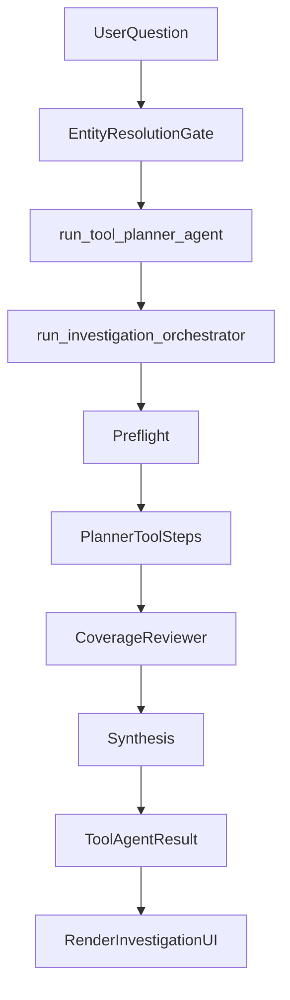

# Session-Scoped Memory Without Core Architecture Changes

## A) Current Architecture (Repo-Aware)

### Runtime flow today
- Streamlit entrypoint is [`/Users/iagolarrondo/Library/CloudStorage/OneDrive-MassachusettsInstituteofTechnology/1. Coursework and academic/Y2 ('25-'26) - IAP, H3 & H4/15.S04 – Gen AI Lab/2. Assignments and deliverables/Manulife Project/src/app/app.py`](/Users/iagolarrondo/Library/CloudStorage/OneDrive-MassachusettsInstituteofTechnology/1. Coursework and academic/Y2 ('25-'26) - IAP, H3 & H4/15.S04 – Gen AI Lab/2. Assignments and deliverables/Manulife Project/src/app/app.py).
- Current user flow is single-turn per run: question input -> optional entity-resolution picker -> `run_tool_planner_agent(question)` -> render latest `ToolAgentResult`.
- `ToolAgentResult` is produced by [`/Users/iagolarrondo/Library/CloudStorage/OneDrive-MassachusettsInstituteofTechnology/1. Coursework and academic/Y2 ('25-'26) - IAP, H3 & H4/15.S04 – Gen AI Lab/2. Assignments and deliverables/Manulife Project/src/llm/tool_agent.py`](/Users/iagolarrondo/Library/CloudStorage/OneDrive-MassachusettsInstituteofTechnology/1. Coursework and academic/Y2 ('25-'26) - IAP, H3 & H4/15.S04 – Gen AI Lab/2. Assignments and deliverables/Manulife Project/src/llm/tool_agent.py) via [`run_investigation_orchestrator` in `/Users/iagolarrondo/Library/CloudStorage/OneDrive-MassachusettsInstituteofTechnology/1. Coursework and academic/Y2 ('25-'26) - IAP, H3 & H4/15.S04 – Gen AI Lab/2. Assignments and deliverables/Manulife Project/src/llm/orchestration.py`](/Users/iagolarrondo/Library/CloudStorage/OneDrive-MassachusettsInstituteofTechnology/1. Coursework and academic/Y2 ('25-'26) - IAP, H3 & H4/15.S04 – Gen AI Lab/2. Assignments and deliverables/Manulife Project/src/llm/orchestration.py).
- Orchestration already does: preflight -> optional extension authoring -> planner tool phases -> reviewer rounds -> synthesis (or merged reviewer+synthesis).

### Existing reusable artifacts
- `ToolAgentResult` already contains compact memory candidates: `question`, `final_text`, `graph_focus_node_id`, `synthesis_rationale`, `judge_rounds`, `steps`, `preflight`, `extension_authoring`.
- Graph anchor extraction logic already exists in [`/Users/iagolarrondo/Library/CloudStorage/OneDrive-MassachusettsInstituteofTechnology/1. Coursework and academic/Y2 ('25-'26) - IAP, H3 & H4/15.S04 – Gen AI Lab/2. Assignments and deliverables/Manulife Project/src/app/investigation_graph.py`](/Users/iagolarrondo/Library/CloudStorage/OneDrive-MassachusettsInstituteofTechnology/1. Coursework and academic/Y2 ('25-'26) - IAP, H3 & H4/15.S04 – Gen AI Lab/2. Assignments and deliverables/Manulife Project/src/app/investigation_graph.py), especially `gather_investigation_anchors()`.
- Entity resolution and question rewriting path is deterministic and pre-investigation in [`/Users/iagolarrondo/Library/CloudStorage/OneDrive-MassachusettsInstituteofTechnology/1. Coursework and academic/Y2 ('25-'26) - IAP, H3 & H4/15.S04 – Gen AI Lab/2. Assignments and deliverables/Manulife Project/src/app/entity_resolution.py`](/Users/iagolarrondo/Library/CloudStorage/OneDrive-MassachusettsInstituteofTechnology/1. Coursework and academic/Y2 ('25-'26) - IAP, H3 & H4/15.S04 – Gen AI Lab/2. Assignments and deliverables/Manulife Project/src/app/entity_resolution.py).

### Session state today
- Existing keys are mainly one-run state (`er_*`, `last_tool_run`, graph page focus keys). There is no multi-turn conversational history model and no session export utility.

## B) Recommended Session Memory Design

### Design principles
- Keep planner/judge/synthesis untouched (no architectural replacement).
- Add a **pre-investigation memory layer** in app flow only.
- Use compact memory snippets, never full chat transcript in every LLM call.
- Route standalone questions unchanged.

### Proposed memory pipeline
1. **Session store (in-memory via `st.session_state`)**
   - Maintain `session_turns` list of compact turn records (user question + selected run outputs).
   - Maintain `active_entities` and `recent_focus_nodes` derived from prior `ToolAgentResult` anchors/focus.
2. **Pre-investigation context resolver (new small module)**
   - Input: new user question + compact memory digest (last 2-4 turns, entity aliases, focus nodes).
   - Output one of:
     - `standalone` (pass-through unchanged),
     - `rewritten_standalone_question` (contextual follow-up resolved),
     - `needs_clarification` (only when ambiguity can’t be safely resolved).
3. **Investigation execution remains identical**
   - Run `run_tool_planner_agent(resolved_question)` exactly as today.
4. **Post-run memory update**
   - Build compact memory record from `ToolAgentResult` (reusing `final_text`, `graph_focus_node_id`, anchors, concise reviewer gap notes).
   - Append to `session_turns`.
5. **UI history + export**
   - Render chat-like history in Streamlit (question, rewritten question if any, answer summary, key entities/focus).
   - Add `Export session report` button that emits structured clean HTML (user-facing, minimal internal traces by default).

### Clarification strategy
- Clarify only when resolver confidence is low and multiple plausible referents exist.
- Reuse existing entity-resolution picker UX pattern where possible for disambiguation.

## C) File-by-File Implementation Plan

1. **Update [`/Users/iagolarrondo/Library/CloudStorage/OneDrive-MassachusettsInstituteofTechnology/1. Coursework and academic/Y2 ('25-'26) - IAP, H3 & H4/15.S04 – Gen AI Lab/2. Assignments and deliverables/Manulife Project/src/app/app.py`](/Users/iagolarrondo/Library/CloudStorage/OneDrive-MassachusettsInstituteofTechnology/1. Coursework and academic/Y2 ('25-'26) - IAP, H3 & H4/15.S04 – Gen AI Lab/2. Assignments and deliverables/Manulife Project/src/app/app.py)
   - Initialize new session keys: `session_turns`, `session_memory_state`, `pending_clarification`.
   - Insert pre-investigation resolver step between `er_pending_question` resolution and `run_tool_planner_agent` call.
   - Keep existing ER flow intact; memory resolver runs before final execution.
   - Store each completed run as a turn record.
   - Render chat-like session history panel above/below current investigation view.
   - Add HTML export button using new report helper.

2. **Add new module [`/Users/iagolarrondo/Library/CloudStorage/OneDrive-MassachusettsInstituteofTechnology/1. Coursework and academic/Y2 ('25-'26) - IAP, H3 & H4/15.S04 – Gen AI Lab/2. Assignments and deliverables/Manulife Project/src/app/session_memory.py`](/Users/iagolarrondo/Library/CloudStorage/OneDrive-MassachusettsInstituteofTechnology/1. Coursework and academic/Y2 ('25-'26) - IAP, H3 & H4/15.S04 – Gen AI Lab/2. Assignments and deliverables/Manulife Project/src/app/session_memory.py)
   - Define typed dataclasses for `SessionTurn`, `MemoryDigest`, `ResolverDecision`.
   - Implement `build_turn_from_result(question, resolved_question, ToolAgentResult)`.
   - Implement compact digest builder (last N turns + canonical entities + recent focus nodes).
   - Reuse `gather_investigation_anchors()` from `investigation_graph.py` to avoid redundant extraction logic.

3. **Add new module [`/Users/iagolarrondo/Library/CloudStorage/OneDrive-MassachusettsInstituteofTechnology/1. Coursework and academic/Y2 ('25-'26) - IAP, H3 & H4/15.S04 – Gen AI Lab/2. Assignments and deliverables/Manulife Project/src/llm/question_context.py`](/Users/iagolarrondo/Library/CloudStorage/OneDrive-MassachusettsInstituteofTechnology/1. Coursework and academic/Y2 ('25-'26) - IAP, H3 & H4/15.S04 – Gen AI Lab/2. Assignments and deliverables/Manulife Project/src/llm/question_context.py)
   - Implement a lightweight resolver function:
     - Fast deterministic heuristics first (pronouns, ellipsis, “that claim”, “same person”).
     - Optional small LLM call only when heuristic uncertainty remains.
   - Return structured decision (`pass_through` / `rewrite` / `clarify`) and rewritten question when applicable.
   - Keep this module independent from planner/judge/synthesis modules.

4. **Optional prompt additions in [`/Users/iagolarrondo/Library/CloudStorage/OneDrive-MassachusettsInstituteofTechnology/1. Coursework and academic/Y2 ('25-'26) - IAP, H3 & H4/15.S04 – Gen AI Lab/2. Assignments and deliverables/Manulife Project/src/llm/prompts.py`](/Users/iagolarrondo/Library/CloudStorage/OneDrive-MassachusettsInstituteofTechnology/1. Coursework and academic/Y2 ('25-'26) - IAP, H3 & H4/15.S04 – Gen AI Lab/2. Assignments and deliverables/Manulife Project/src/llm/prompts.py)
   - Add a compact system prompt for question contextualization/rewrite JSON output.
   - No changes to existing planner/judge/synthesis prompts.

5. **Add new module [`/Users/iagolarrondo/Library/CloudStorage/OneDrive-MassachusettsInstituteofTechnology/1. Coursework and academic/Y2 ('25-'26) - IAP, H3 & H4/15.S04 – Gen AI Lab/2. Assignments and deliverables/Manulife Project/src/app/session_report.py`](/Users/iagolarrondo/Library/CloudStorage/OneDrive-MassachusettsInstituteofTechnology/1. Coursework and academic/Y2 ('25-'26) - IAP, H3 & H4/15.S04 – Gen AI Lab/2. Assignments and deliverables/Manulife Project/src/app/session_report.py)
   - Generate clean structured HTML report:
     - session metadata,
     - turn-by-turn user question + rewritten question (if any),
     - final answer excerpt,
     - key entities/focus nodes,
     - optional compact reviewer notes.
   - Keep raw tool trace excluded by default, with optional flag to include compact technical appendix later.

6. **Tests (new/updated under [`/Users/iagolarrondo/Library/CloudStorage/OneDrive-MassachusettsInstituteofTechnology/1. Coursework and academic/Y2 ('25-'26) - IAP, H3 & H4/15.S04 – Gen AI Lab/2. Assignments and deliverables/Manulife Project/tests`](/Users/iagolarrondo/Library/CloudStorage/OneDrive-MassachusettsInstituteofTechnology/1. Coursework and academic/Y2 ('25-'26) - IAP, H3 & H4/15.S04 – Gen AI Lab/2. Assignments and deliverables/Manulife Project/tests))
   - Unit tests for memory digest construction and turn extraction from `ToolAgentResult`.
   - Resolver tests for standalone vs rewrite vs clarify cases.
   - Report generator tests for HTML structure and safe escaping.

## D) Risks and Decisions to Review Before Coding

- **Resolver aggressiveness**: too aggressive rewrites can reduce intelligence; default should be conservative pass-through.
- **Clarification UX**: choose whether to reuse ER picker form vs a simpler yes/no clarification prompt for pronoun ambiguity.
- **LLM call budget**: decide whether contextual rewrite is always deterministic-first with fallback LLM, or always LLM-based.
- **History size limits**: cap turns and digest size to prevent context bloat (e.g., retain last 20 turns for UI, summarize last 3-4 for rewrite).
- **Report privacy/content**: confirm whether report should include reviewer rationale and preflight decisions by default, or keep strictly user-facing findings.
- **Back-compat behavior**: if resolver fails, hard fallback to current behavior (`run_tool_planner_agent` with original question).

## Execution sequencing (practical)
- Phase 1: data models + memory digest + UI history scaffolding.
- Phase 2: contextual resolver integration with conservative defaults.
- Phase 3: HTML report export.
- Phase 4: tests + tuning thresholds with real follow-up queries.