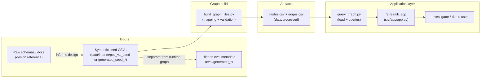

# Technical flow — PoC v1

A one-page view of how data moves through the prototype and what is (and is not) production-ready.

**Note:** The main Streamlit investigation path uses a **tool planner → coverage judge → synthesis** loop (see **[README.md](../README.md)**). Optional **`src/llm/router.py`** intent routing exists for other scripts; it is not the primary driver of `app.py`.

---

## 1. Prototype architecture (short)

The PoC is a **local pipeline** that turns **tabular seed extracts** into a **property graph** stored as two CSV files, then serves **investigation-style queries** through a **Streamlit** UI.

- **Build:** Python reads normalized “resolved” and policy/claim tables, assigns stable **node ids**, and emits **edges** only when both endpoints exist.
- **Query:** Code loads the CSVs into an in-memory graph (NetworkX), runs focused queries (claim neighborhood, shared banks, family clusters, business–address overlap), and returns tables plus short narratives.
- **App:** Streamlit loads the graph once per browser session (`st.session_state`). Each question can be adjusted by **session memory** (rewrite / clarify follow-ups from prior turns, then optional entity-resolution picks) before the **unchanged** planner → judge → synthesis run; the UI can **export** an HTML session report or **clear** in-tab memory.

Code lives mainly under `src/graph_build/`, `src/graph_query/`, `src/llm/`, `src/app/`, and **`src/session/`** (memory + resolver + HTML report helpers).

---

## 2. End-to-end flow (diagram)

**How to read it:** Arrows show dependency order. Raw schemas and documentation do not feed the build script directly; they shape synthetic generation rules. Hidden eval files are intentionally separated and are not consumed by graph build or runtime queries.

---

## 3. Real vs synthetic vs future-state

| Category | What it means in this repo |
|----------|----------------------------|
| **Synthetic (PoC v1)** | All rows under `data/interim/poc_v1_seed/` are **made-up** scenarios (names, policies, claims, banks, businesses). Safe for demos and screenshots. |
| **Real (process, not data)** | The **steps** mirror how a real pipeline could work: staged tables → graph export → query API → UI. File layouts (`nodes.csv` / `edges.csv` columns) reflect a deliberate **design choice**, not live systems. |
| **Real (tooling)** | Python, pandas, NetworkX, Streamlit, and pytest are **standard** tools; teammates can run everything **on their laptop** with no corporate API keys for this PoC. |
| **Future-state** | **Live** feeds from claims, policy, party, and bank systems; **LLM** routing or summarization; **access control** and **audit**; **scale** (bigger graphs, graph DB); **human-in-the-loop** workflows tied to case management. None of that is required to run or understand v1. |

---

For **how to run** the build, app, and tests, see the project **[README.md](../README.md)**. For **demo talking points**, see **[demo_cases.md](demo_cases.md)**.
